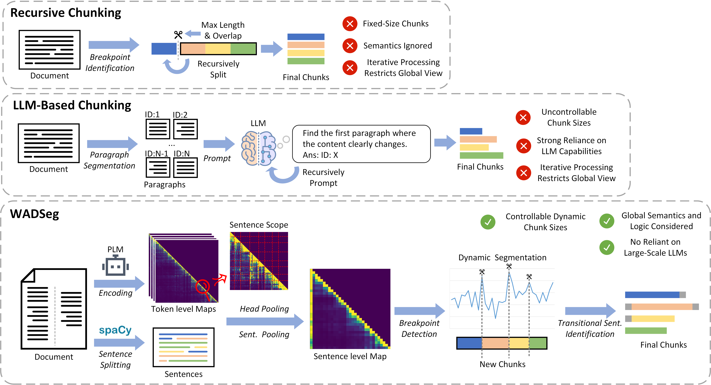

# WADSeg
This is the code for our paper **WADSeg: Exploiting Weak Attention Associations for Enhanced Knowledge Segmentation in RAG. (Under Review)**

WADSeg is designed to be a modular optimization method for Retrieval-Augmented Generation (RAG) frameworks, focusing on knowledge segmentation. It utilizes weak attention associations to identify semantic discontinuities in text documents, leading to improved retrieval accuracy and reasoning capabilities in Large Language Models (LLMs).

*This project is designed as a Python package, which can be quickly installed and used locally. You can refer to demo.py to learn how to use it.*

## Abstract
  Retrieval-Augmented Generation serves as a significant auxiliary framework for equipping Large Language Models with external knowledge, whose performance benefits from modular optimization.  However, the importance of knowledge segmentation as the first stage of Retrieval-Augmented Generation is often overlooked. Both the size and quality of text chunks play a critical role in the retrieval accuracy of retrievers and the reasoning capability of Large Language Models. To address this challenge, this paper introduces WADSeg, a novel segmentation approach that analyzes document attention map features to identify natural semantic discontinuities for enhanced segmentation. WADSeg uniquely features controllable, dynamic chunk sizing for improved semantic and logical coherence and incorporates sentence-level encoding with global semantic breakpoint identification to mitigate local noise. Crucially, extensive experiments across multiple datasets demonstrate that WADSeg outperforms baselines rule-based and large language model-based baselines in terms of retrieval accuracy and scalability. These findings validate WADSeg's ability to perform more semantically coherent and stable knowledge segmentation, establishing it as an effective modular optimization method to improve the overall performance of Retrieval-Augmented Generation frameworks.

## Structure

